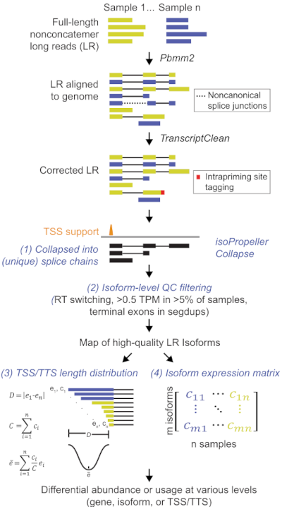
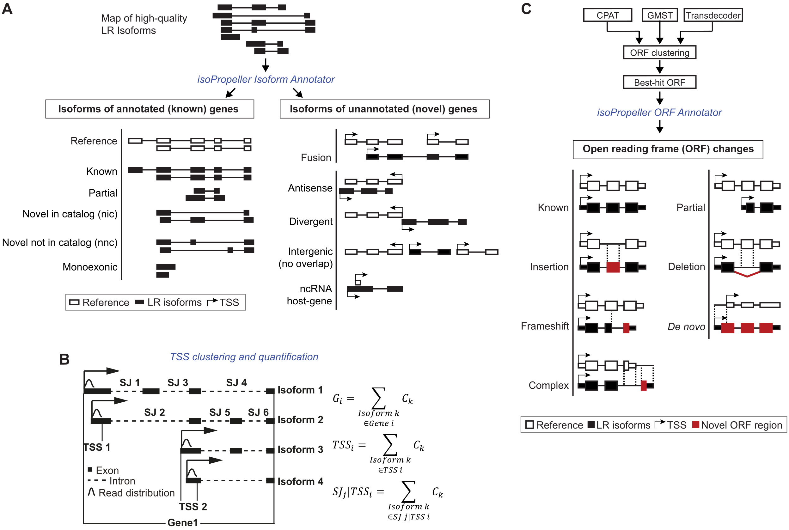

[](https://anaconda.org/pintod02/isopropeller)

[](https://github.com/PintolabMSSM/isoPropeller/blob/main/LICENSE)

## IsoPropeller

This repository is part of a suite of three interconnected repositories that together form the **isoPropeller** computational framework for the analysis of long-read RNA-seq data:

- **isoPropeller**: The core standalone command-line utilities.
- **isoPropeller-collapse**: Snakemake workflow for read processing, RNA isoform discovery, and QC.  
- **isoPropeller-annotate**: Snakemake workflow for functional characterization of isoforms and coding sequences.

The isoPropeller framework provides an end-to-end solution including read processing, quality control, and reference-free transcript model reconstruction across biological replicates, followed by quantification, high-stringency filtering, and functional annotation.

The core isoPropeller repository provides the tools for collapsing alignments into non-redundant isoforms, analyzing transcription start/termination site (TSS/TTS)  distributions, and providing reference-based isoform classifications. It is designed to support both "Call & Join" workflows, where transcripts are identified in individual samples before merging, and "Join & Call" strategies, where isoforms are further clustered across samples to increase the sensitivity for discovering rare, lowly-expressed novel isoforms. This is possible because isoPropeller retains the full splice-chain, read count, and TSS/TTS information per sample. By providing high-fidelity intrapriming filtering and coordinate-aware collapsing, isoPropeller facilitates the construction of consensus transcriptomes across diverse research objectives and computational scales.

> **Note on Usage:** While the standalone commands are detailed below, the recommended way to use isoPropeller is via the automated **[isoPropeller-collapse](https://github.com/PintolabMSSM/isoPropeller-collapse)** and **[isoPropeller-annotate](https://github.com/PintolabMSSM/isoPropeller-annotate)** Snakemake workflows. These workflows manage dependencies, parallelization, and data integration automatically.

IsoPropeller is available as an anaconda package: https://anaconda.org/channels/pintod02/packages/isopropeller/overview


## Overview of the IsoPropeller collapse workflow

The overall outline of the isoPropeller collapse workflow is shown below. Briefly, reads are first collapsed into isoforms per sample. During this stage, intrapriming filtering is performed to remove reads that were primed from AT-rich regions in the genome rather than valid termination sites. Transcription start and termination sites (TSS/TTS) are also annotated during this stage for further downstream analysis of isoform ends. Finally, the per-sample results are optionally filtered to keep only isoforms detected by two or more reads, and merged across all samples in a dataset by clustering identical splice-chains.





### Reference-free transcript model reconstruction per sample

The `isoPropeller` command is used to collapse reads in a .bam file into isoforms in a .gtf file. Reads that are likely intrapriming are filtered out. Monoexonic reads without 5' support are also filtered out. Multiexonic reads with the exact set of exon-exon junction(s) and being mapped in the same direction will be collapsed into one transcript. On the other hand, overlapping monoexonic transcripts will be merged to generate one transcript. In both cases, the longest 5' and 3' ends, among the transcripts to be merged, will be taken as the boundaries of the transcript. The distribution of all 5' and 3' ends will also be recorded.

```bash
# Run isoPropeller on an individual aligned bam file
isoPropeller \
   -i <prefix>.bam \
   -e \
   -p <prefix> \
   -o <prefix> \
   -g <genome.fa> \
   -f <tss-bed-file> \
   -t <number of threads>

# Get transcript IDs for isoforms with 2 or more reads on autosomes and sex chromosomes 
grep $'\t'"transcript"$'\t' <prefix>.gtf \
   | grep "^chr" \
   | grep -v "^chrM" \
   | grep -v "depth \"1\"" \
   | cut -d'"' -f4 \
   > temp_transcript_id.txt

# Filter gtf files based based on these IDs
select_gtf_by_attribute_list.pl \
   <prefix>.gtf \
   <prefix>_1more.gtf \
   temp_transcript_id.txt \
   transcript_id

# Cleanup
rm temp_transcript_id.txt
```

IsoPropeller, by default, will filter out reads predicted as intrapriming, which can be adjusted using the `-w`, `-r` and `-v` options. Alternatively, considering the accuracy of 3' end in long-read data, it is reasonable to keep an intrapriming read if its 3' end is close to any annotated 3' ends. IsoPropeller provides an option, `-l`, to specify a bed file including regions that are close to any annotated 3' ends. For example, these regions can include any annotated 3' terminal exon plus 500 nucleotides downstream.

```bash
# Generate a list of terminal exon regions in bed format
prepare_intrapriming_rescue_bed.pl \
   -i gencode.v41.annotation.gtf \
   -o gencode.v41.annotation_500bp \
   -d 500

# Run isopropeller while disabling the intrapriming filter in terminal exons
isoPropeller \
   -i <prefix>.bam \
   -e -p <prefix> \
   -o <prefix> \
   -g <genome.fa> \
   -f <tss-bed-file> 
   -l gencode.v41.annotation_500bp_terminal.bed \ 
   -t <number of threads>
```


### Reference-free transcript model reconstruction by merging isoforms across samples

The script `isoPropeller_merge` is used to merge the isoform .gtf files of different samples by merging isoforms with the same structure and renaming consistently. Multiexonic transcirpts with the exact set of exon-exon junction(s) and being transcribed from the same direction will be merged into one representative transcript. On the other hand, overlapping monoexonic transcripts will be merged to generate a representative transcript. In both cases, the longest 5' and 3' ends, among the transcripts to be merged, will be taken for the representative transcript. A schematic illustration is shown above.

```bash
# Gather list of all gtf files for merging
for gtf in `ls *_1more.gtf`
do
   echo $gtf; 
done > temp_gtf_list.txt

# Run isoPropeller_merge
isoPropeller_merge \
   -i temp_gtf_list.txt \
   -o MAP \
   -p MAP \
   -e depth \
   -t <number of threads>

# Clean up
rm temp_gtf_list.txt
```

The input is a plain text file specifying the list of .gtf file(s) to be merged, one for each row. The full path to the file is needed.

A file nameed `MAP.gtf` of the representative transcirpts after merging and a plain text file named `MAP_id.txt`, indicating the source of each representative transcripts, will be generated. The `MAP_id.txt` file is consisted of three columns, where the first two columns indicating the gene ID and transcript ID of the representative transcripts, the third one indicating `","` delineated original IDs before merging.

The IDs of a gene and a transcript after merging as `"MAP_<CHR>_[01]_<LOCI_NUM>_<SUB_LOCI_NUM>"` and `"MAP_<CHR>_[01]_<LOCUS_NUM>.<TRANSCRIPT_NUM>"`, respectively. The `"<CHR>"` value indicates the chromosome name. The `"[01]"` value indicates the strand of the locus, or transcript, with `"0"` meaning the `"+"` strand and `"1"` meaning the `"-"` one. The `"<LOCI_NUM>"` indicates the positional order of a locus at a strand. A locus is defined as a region consisted of overlapping transcripts, with each overlapping region containing at least two transcripts. The `"<SUB_LOCI_NUM>"` indicates sub-loci in on locus containing multiexonic transcripts sharing exon boundaries, or monoexonic transcripts having exonic overlapping with exons from other transcripts. The `"<TRANSCRIPT_NUM>"` is a unique identifier of a transcript in the corresponding locus.


### Clustering of unique splice-chain based on 5' and 3' ends

The merged multiexonic isoforms can be further split to different isoforms clusters based on their 5' and 3' ends using the `isoPropeller_merge_split` script. The output files `*_end_dist.txt` from the **Isoform identification** step for all samples are needed, as well as the `MAP_id.txt` file from the **Merging multiple samples** step.

```bash
for ed in `ls *_end_dist.txt`; do echo $ed; done > temp_end_dist_list.txt
perl isoPropeller_merge_split -i temp_end_dist_list.txt -o MAP_clustered -g MAP.gtf -d MAP_id.txt -t <number of threads>
rm temp_end_dist_list.txt
```

Four files will be generated, with `MAP_clustered.gtf` containing all isoforms, `MAP_clustered_exp.txt` containing the read count, `MAP_clustered_tss.bed` containing the TSS regions and `MAP_clustered_tts.bed` containing the TTS regions after the clustering step. All gene_id tags in the .gtf file will remain the same. A string `_\<cluster ID\>` will be appended to the original transcript_id to indicate which cluster of a unique splice-chain the isoform belongs to.

### Defining TSS/TTS regions

Since the TSSs/TTSs positions can be variable for splice-chains, they are further grouped into regions.

```bash
for ed in `ls *_end_dist.txt`; do echo $ed; done > temp_end_dist_list.txt
perl isoPropeller_end_region -i temp_end_dist_list.txt -o MAP -d MAP_id.txt -t <number of threads>
rm temp_end_dist_list.txt
```

Two files will be generated, with `MAP_tss.bed` and `MAP_tts.bed` indicating the TSS and TTS regions for each isoform, respectively. For considering TSS/TTS support for an isoform, it is recommended to use the TSS/TTS region, instead of a single-base position.

### Preparing 5' and 3' end metrics

In the **Isoform identification** step, read depths of all TSS-TTS combination in a unique splice-chain are recorded in the `*_end_dist.txt` file. Various metrics are calculated from this file, including the following:

```
ends_entropy:                     The entropy of TSS-TTS combination
num_tss/num_tts:                  The numer of TSS/TTS
tss_mass_center/tts_mass_center:  The depth weighted TSS/TTS position
tss_entropy/tts_entropy:          The entropy of TSS/TTS position
tss_sd/tts_sd:                    The standard deviation of TSS/TTS position
tss_max_diff/tts_max_diff:        The range of possible TSS/TTS
```

Each of the above metrics can be combined across all samples into a matrix for downstream analyses:

```bash
for ed in `ls *_end_dist.txt`
do
  prefix=`basename $ed .txt`
  perl isoPropeller_end_dist -i $ed -o ${ed}_parsed.txt
done

for ed in `ls *_end_dist_parsed.txt`; do echo $ed; done > temp_end_dist_list.txt
perl isoPropeller_merge_end_dist -i temp_end_dist_list.txt -o MAP -m MAP_id.txt

for type in `echo ends_entropy tss_entropy tss_mass_center tss_max_diff tss_sd tts_entropy tts_mass_center tts_max_diff tts_sd`
do
  head -1 MAP_${type}.txt | sed 's/\t/\n/g' | cut -d'/' -f8 | tr '\n' '\t' | sed 's/\t$/\n/' > MAP_${type}_renamed.txt
  tail -n+2 MAP_${type}.txt >> MAP_${type}_renamed.txt
done
```

The output files `MAP_${type}_renamed.txt` are the matrices of all the metrics with proper headers.


## Overview of the isoPropeller reference-based annotation workflow

In this step, all isoforms per sample or merged across samples will be compared with the reference annotation and **(A)** classified according to their overlaps. **(B)** Transcription start (TSS) and termination sites (TTS) will also be clustered into regions. **(C)** Finally, open reading frames (ORF) regions are also identified, leveraging annotations by [CPAT](https://github.com/liguowang/cpat), [GeneMark-ST](https://exon.gatech.edu/), and [TransDecoder](https://github.com/TransDecoder/TransDecoder). 



As an example, the merged output file `MAP.gtf` produced in the previous section will be annotated in this step. The resulting output file `MAP_gencode.gtf` will contain the annotations.

```bash
perl isoPropeller_annotate -q MAP.gtf -r gencode.v41.annotation.gtf -o MAP_gencode.gtf -e /sc/arion/projects/EPIASD/IsoSeq_ourdata/NIAP_merged/MAP_cleaned_unfiltered_tss.bed -t <number of threads>
```

The code block below can be used to extract a summary of the annotations.

```bash
for attribute in `echo ref_transcript_id asm_gene_id ref_gene_id gene_type gene_name status`; do echo $attribute; done > temp_attribute_list.txt
perl gtf2summary.pl -i MAP_gencode.gtf -o MAP_gencode -a temp_attribute_list.txt -j merged-intropolis-PEC-GTEX-owndata.SJ.out.tab -r -t <number of threads>
```

## Contributors
The IsoPropeller core tools and snakemake workflows are developped and maintained by [Xiao Lin](https://github.com/alanlamsiu), [Yoav Hadas](https://github.com/yoavhadas), and [Dalila Pinto](https://github.com/ddpinto) at the Icahn School of Medicine at Mount Sinai.
If you want to contribute, please leave an issue. Thank you.

The source code is available under the GPL3.0 license.

## Citation
The paper describing isoPropeller is in preparation. Stay tuned!

## Feedback and bug reports
We welcome your comments, bug reports, and suggestions. They will help us to further improve IsoPropeller. You may submit feedback and bug reports through our GitHub repository issue tracker.
